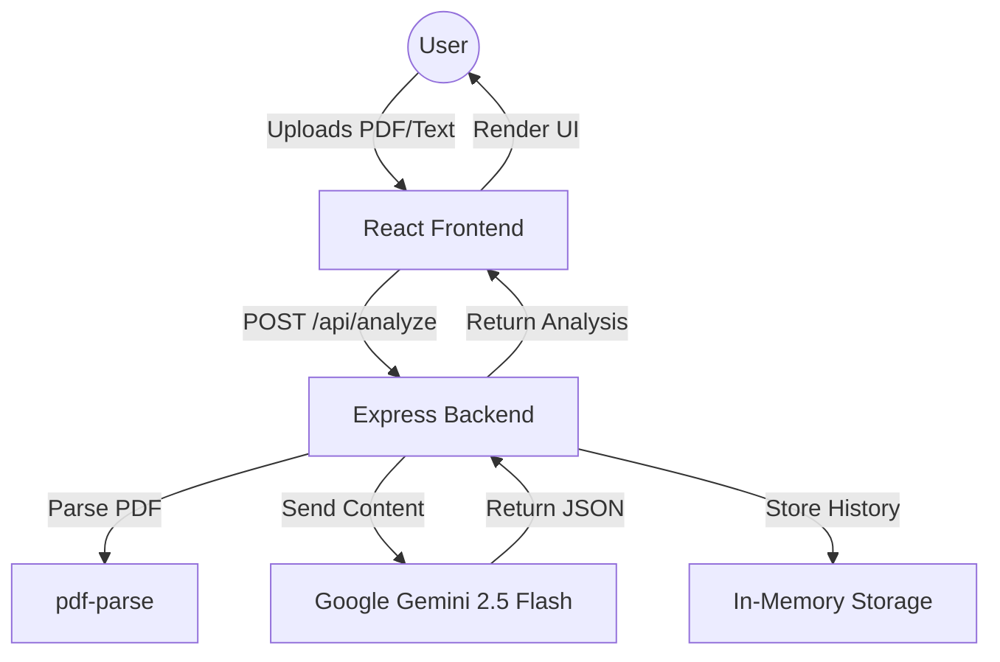

# AI Resume Analyzer 📄🚀

[](https://opensource.org/licenses/MIT)
[](https://nodejs.org/)
[](https://react.dev/)
[](https://groq.com/)

A professional, high-performance, and AI-powered platform designed to help job seekers optimize their resumes for Applicant Tracking Systems (ATS) and professional impact.

---

## 1. PROJECT OVERVIEW

### Problem Statement
In the modern job market, over 75% of resumes are filtered out by Applicant Tracking Systems (ATS) before they ever reach a human recruiter. Many high-quality candidates fail to secure interviews because their resumes lack the specific keywords, formatting, or quantifiable achievements required by these automated systems.

### Purpose of the Project
**AI Resume Analyzer** (formerly known as ResumeIQ) is an enterprise-grade solution that bridges the gap between candidates and recruiters. By leveraging state-of-the-art Generative AI (Groq Mixtral), the platform provides real-time, actionable feedback to transform a standard resume into a high-impact, ATS-optimized professional document.

### Key Goals and Objectives
- **ATS Optimization**: Detect and resolve common parsing issues that cause resumes to be rejected.
- **Job Matching**: Quantify how well a candidate's profile aligns with a specific job description.
- **AI-Driven Rewriting**: Automatically rewrite resume sections to enhance professionalism and impact.
- **Actionable Insights**: Provide clear, prioritized steps for resume improvement.

### Target Users
- **Job Seekers**: Entry-level to senior professionals looking to optimize their resumes.
- **Career Coaches**: Professionals who need a tool to provide data-driven feedback to clients.
- **Students**: Graduates looking to start their professional journey with a strong resume.

### Real-World Applications
- Preparing for high-stakes interviews.
- Cross-referencing skills against multiple job descriptions.
- Rapidly updating resumes for different roles using AI suggestions.

---

## 2. SYSTEM ARCHITECTURE

### High-Level Architecture
The project follows a modern **Full-Stack JavaScript** architecture using a decoupled Client-Server model.

- **Frontend**: A highly interactive React 19 application built with Vite and Tailwind CSS.
- **Backend**: A robust Express.js server serving as the orchestration layer for AI processing and history management.
- **AI Layer**: Integration with Groq (Llama 3.3 70B) for deep semantic analysis and natural language generation.

### Component Interactions


### Data Flow Explanation
1.  **Ingestion**: The user uploads a PDF or pastes resume text.
2.  **Extraction**: The backend uses `pdf-parse` (with custom polyfills) to extract raw text from binary PDF files.
3.  **Analysis**: The extracted text is combined with expert prompts and sent to the Gemini API.
4.  **Transformation**: Raw AI responses are validated using JSON schemas and mapped to UI components.
5.  **Persistence**: Recent analyses are stored in an in-memory storage layer for quick session-based access.

---

## 3. TECHNOLOGY STACK

### Core Technologies
- **Programming Language**: TypeScript (End-to-end type safety).
- **Frontend Framework**: React 19 (Latest features including improved hooks).
- **Styling**: Vanilla CSS with Tailwind CSS 4.0 & Radix UI (Premium, accessible components).
- **Backend Runtime**: Node.js with Express.js.
- **Database/Storage**: In-Memory Storage (with Drizzle ORM ready for SQL migration).
- **AI Engine**: Google Gemini 2.5 Flash (Generative AI).

### Why These Choices?
- **React 19 & Vite**: Chosen for blazingly fast development and a smooth, reactive user experience.
- **Gemini 2.5 Flash**: Offers a superior balance of speed, cost-effectiveness, and deep reasoning capabilities compared to other LLMs.
- **Drizzle ORM**: Provides a type-safe way to interact with data, making it easy to swap in-memory storage for a persistent PostgreSQL database in the future.
- **Wouter**: A lightweight alternative to React Router, perfect for minimalist, high-performance SPAs.

---

## 4. PROJECT STRUCTURE

```text
├── .agents/                # AI Assistant workflows
├── client/                 # Frontend application
│   ├── src/
│   │   ├── components/     # UI Components (Radix + Shadcn-style)
│   │   ├── hooks/          # Custom React hooks (useMobile, etc.)
│   │   ├── lib/            # Client-side utilities (queryClient)
│   │   ├── pages/          # Main route components (Landing, Analyze, History)
│   │   └── App.tsx         # Main application entry and routing
├── server/                 # Backend application
│   ├── lib/
│   │   ├── gemini.ts       # AI prompt configuration and API logic
│   │   ├── parser.ts       # PDF processing and text extraction
│   ├── index.ts            # Server entry point and middleware
│   ├── routes.ts           # API endpoint definitions
│   ├── storage.ts          # Storage abstraction and in-memory implementation
├── shared/                 # Code shared between client and server
│   └── schema.ts           # Zod schemas and TypeScript types
├── public/                 # Static assets
└── package.json            # Project dependencies and scripts
```

---

## 5. INSTALLATION GUIDE

### Prerequisites
- **Node.js**: v20.x or higher
- **npm**: v10.x or higher
- **Groq API Key**: Obtain from [Groq Cloud](https://console.groq.com/)

### Step-by-Step Setup
1.  **Clone the repository**:
    ```bash
    git clone https://github.com/your-repo/ai-resume-analyzer.git
    cd ai-resume-analyzer
    ```

2.  **Install dependencies**:
    ```bash
    npm install
    ```

3.  **Configure Environment Variables**:
    Create a `.env` file in the root directory:
    ```env
    GROQ_API_KEY=your_key_here
    PORT=5003
    ```

4.  **Run in Development Mode**:
    ```bash
    npm run dev
    ```
    The application will be available at `http://localhost:5000` (Vite Proxy) or `http://localhost:5003` (Server).

### Common Setup Issues
- **PDF Polyfill Error**: If you see "DOMMatrix is not defined", ensure the polyfill in `server/lib/parser.ts` is correctly implemented.
- **Port Conflict**: If port 5003 is in use, change the `PORT` variable in `.env`.

---

## 6. CONFIGURATION

### Environment Variables
| Variable | Description | Default |
| :--- | :--- | :--- |
| `GROQ_API_KEY` | Your Groq Cloud API Key | Required |
| `PORT` | The port the server runs on | `5003` |
| `NODE_ENV` | Environment (development/production) | `development` |

---

## 7. FEATURES

### 1. Advanced Resume Analysis
- **Scoring**: Instant 0-100 rating based on professional standards.
- **ATS Check**: Identifies if the resume is "Excellent", "Needs Improvement", or "Poor" for automated systems.
- **Keyword Identification**: Highlights keywords found and missing based on the industry standard.

### 2. Job Description Matching
- Upload a job description to see a tailored match score.
- **Gap Analysis**: Identifies exactly which requirements you are missing.
- **Interview Prep**: Generates 4 likely interview questions based on your profile gaps.

### 3. AI Section Rewriting
- Break your resume down into logical sections.
- Apply specific instructions (e.g., "Make it more data-driven") to rewrite entire sections instantly.
- Compare "Original" vs "Rewritten" text with clear improvement bullet points.

---

## 8. MODULE EXPLANATION

### `server/lib/gemini.ts`
The brain of the system. It contains the prompt engineering logic, structured JSON schemas for AI responses, and error handling for the Gemini API.

### `server/lib/parser.ts`
Handles binary file processing. It uses `pdf-parse` to convert resumes into a format the AI can understand, including necessary polyfills for Node.js environments.

### `server/storage.ts`
An abstracted interface for data persistence. Currently implements `MemStorage` for ultra-fast, session-based history without the need for a persistent database setup.

---

## 9. API DOCUMENTATION

### Base URL: `/api`

| Endpoint | Method | Description |
| :--- | :--- | :--- |
| `/health` | GET | Returns system and AI configuration status. |
| `/analyze` | POST | Analyzes a resume (file or text) and optional job description. |
| `/rewrite` | POST | Takes resume text and instructions to return rewritten sections. |
| `/history` | GET | Fetches the recent analysis history. |
| `/history` | DELETE | Clears the current analysis history. |

---

## 10. AI / MACHINE LEARNING

### Model Architecture
The project utilizes the **Gemini 2.5 Flash** model, which is optimized for latency and high-volume structured output tasks.

### Prompt Strategy
The system uses **Few-Shot Prompting** and **Strict Schema Enforcement** to ensure the AI always returns valid JSON that the frontend can parse reliably. Prompts are designed as specialized roles (e.g., "Expert Technical Recruiter").

---

## 11. DATABASE DESIGN

The system uses **Drizzle ORM** with a schema-first approach. 

### Schema (`shared/schema.ts`)
```typescript
export const users = pgTable("users", {
  id: varchar("id").primaryKey(),
  username: text("username").notNull(),
  password: text("password").notNull(),
});
```
*Note: In the current version, the `analyses` are kept in an in-memory array on the server for performance and ease of deployment.*

---

## 12. USER WORKFLOW

1.  **Landing**: User discovers the platform and its capabilities.
2.  **Upload**: User uploads a resume (PDF/DOCX/TXT) or pastes text.
3.  **Context**: (Optional) User provides a job description for matching.
4.  **Process**: AI processes the request (usually in 2-4 seconds).
5.  **Review**: User explores the dashboard, scores, and charts.
6.  **Refine**: User uses the AI Rewrite tool to improve specific sections.
7.  **History**: User revisits previous analyses via the History tab.

---

## 13. PERFORMANCE OPTIMIZATION

- **Vite Bundling**: Minimal bundle size through tree-shaking and asset optimization.
- **In-Memory Caching**: Quick retrieval of results within the same session.
- **Model Choice**: Gemini 2.5 Flash provides significantly faster response times (sub-3 seconds) compared to Gemini Pro or GPT-4o.

---

## 14. SECURITY CONSIDERATIONS

- **Helmet.js**: Implements various HTTP headers to protect against common attacks (XSS, Clickjacking).
- **Rate Limiting**: 
    - 60 requests/min for general API.
    - 10 requests/min for AI-heavy endpoints to prevent abuse and API cost spikes.
- **Sanitization**: Input text is validated via Zod before processing.

---

## 15. TESTING

The project uses a manual verification workflow complemented by TypeScript build checks.
- **Static Analysis**: `npm run check` (TypeScript verification).
- **Build Verification**: `npm run build` ensures all assets and server bundles are production-ready.

---

## 16. DEPLOYMENT

### Production Setup
1.  Run the build script: `npm run build`.
2.  Start the production server: `npm start`.
3.  Ensure `NODE_ENV=production` is set.

---

## 17. FUTURE IMPROVEMENTS

- [ ] **Persistent Database**: Integration with PostgreSQL for permanent user accounts.
- [ ] **Direct Export**: Export improved resumes directly to PDF/Docx.
- [ ] **Multi-Resume Comparison**: Compare progress over multiple versions of the same resume.
- [ ] **LinkedIn Integration**: Import profile data directly via URL.

---

## 18. TROUBLESHOOTING

- **Empty Reports**: Ensure the PDF is not an image-only (scanned) document. Use a text-based PDF.
- **API Key Errors**: Double-check that your `GEMINI_API_KEY` is active and has sufficient quota.

---

## 19. CONTRIBUTING

1. Fork the Project.
2. Create your Feature Branch (`git checkout -b feature/AmazingFeature`).
3. Commit your Changes (`git commit -m 'Add some AmazingFeature'`).
4. Push to the Branch (`git push origin feature/AmazingFeature`).
5. Open a Pull Request.

---

## 20. LICENSE

Distributed under the MIT License. See `LICENSE` for more information.

---

## 21. ACKNOWLEDGEMENTS

- [Lucide React](https://lucide.dev/) for the beautiful icons.
- [Radix UI](https://www.radix-ui.com/) for accessible components.
- [TanStack Query](https://tanstack.com/query/latest) for powerful data fetching.
